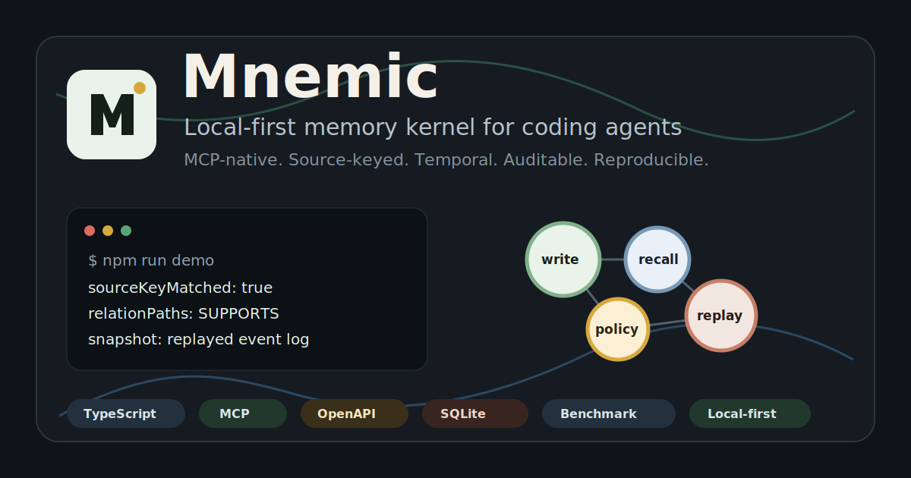
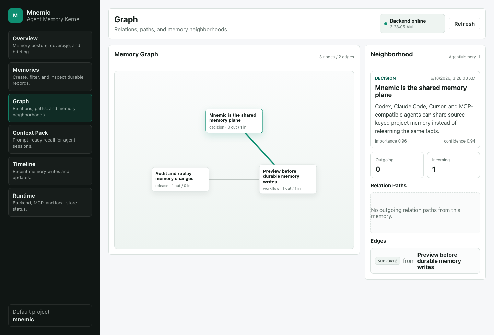

# Mnemic



Mnemic is a local-first memory kernel for coding agents and LLM applications.

It gives Codex, Claude Code, Cursor, Copilot-style agents, and custom MCP clients one shared, auditable, graph-backed long-term memory layer. Agents write source-keyed memories, preview changes before they become durable, recall facts as of a point in time, explain why recall selected a record, and turn the memory graph into prompt-ready context packs and session briefings.

The repo is TypeScript-first, MCP-native, and shaped for the 2026 agent-memory stack: durable memory outside the context window, inspectable provenance, local defaults, governance before writes, and reproducible evals.



## Why Mnemic

Mnemic is not a vector-store wrapper or a hidden chat-summary cache. It is a repo-scoped memory plane that agents can inspect, replay, and govern.

Modern agent platforms already treat memory as infrastructure: MCP standardizes tool and data connections, agent SDKs expose session state, and long-term memory benchmarks increasingly test temporal recall, workflow knowledge, and stale facts. Mnemic focuses on the missing developer layer between those pieces.

| Hot-path problem | Mnemic answer |
| --- | --- |
| Every coding agent relearns the same project facts | Shared MCP, CLI, SDK, and HTTP memory surface |
| Memory writes drift or duplicate across sessions | Source-keyed idempotent writes plus preview before save |
| "Why did the agent remember this?" is hard to debug | Recall explanations with matched fields, score parts, and relation paths |
| Old facts keep beating corrected facts | `validFrom` / `validTo` plus `asOf` temporal recall |
| Audit and handoff need more than final state | Append-only events, first-class diffs, JSONL export/import, rollback preview |
| Launch claims need proof | `demo`, `benchmark`, `doctor`, `openapi:check`, `package:check`, and `launch:check` |

## Five-Minute Demo

```bash
npm install
npm run demo
```

The demo starts an isolated backend on a random local port, writes a small coding-agent memory graph, previews an idempotent update, explains recall, builds a context pack, prints a session briefing, audits memory hygiene, shows the append-only timeline, replays an event-log snapshot, and writes a launch report.

The same replay path is available from the CLI as `mnemic snapshot`, from MCP as `mnemic_snapshot`, and from HTTP as `GET /api/agent-memory/snapshot`.

Expected landmarks:

```text
Mnemic Memory Write Preview
sourceKeyMatched: true
changedFields: confidence, content, importance, updatedAt

Mnemic Recall Explanation
matchedFields: content, sourceKey, tags, title
relationPaths: ...

Mnemic Memory Audit
blocks: 0
warnings: 0

Mnemic Memory Snapshot
eventsReplayed: 5
relations: 2
```

Demo artifacts are written to `target/mnemic-launch-demo/`, including `mnemic-launch-report.md`. Demo details live in [examples/coding-agent-memory](examples/coding-agent-memory/README.md).

## Quickstart

Initialize local config for a clone:

```bash
npm run init
```

This generates `.env.mnemic`, `.mnemic/policy.json`, `.mcp.json`, and `AGENTS.mnemic.md` without overwriting existing files. Use `node mnemic-cli/dist/index.js init --force` to refresh generated files.

Run the readiness doctor:

```bash
npm run doctor
```

Validate the OpenAPI contract:

```bash
npm run openapi:check
```

Run the deterministic benchmark:

```bash
npm run benchmark
```

It writes `target/mnemic-benchmark/mnemic-eval-report.md` and currently checks recall@5, mean hit rank, stale false positives, relation-path coverage, and latency without requiring a model provider. See [docs/benchmark-baseline.md](docs/benchmark-baseline.md) and [docs/benchmark-landscape.md](docs/benchmark-landscape.md).

## Docker

```bash
docker compose -f docker-compose.agent-memory.yml up -d --build mnemic-memory-backend
curl -fsS http://127.0.0.1:8088/actuator/health
```

See [docs/docker-quickstart.md](docs/docker-quickstart.md) for SQLite mode, stop commands, optional Neo4j profile, and Docker readiness checks.

## What Ships Today

| Surface | Current capability |
| --- | --- |
| HTTP API | remember, preview, temporal recall, explain, context pack, briefing, stats, policy, audit, timeline, JSONL export/import, rollback |
| API contract | OpenAPI 3.1 contract plus a local/CI drift check for route and schema coverage |
| SDK | shared TypeScript contracts plus `MnemicClient` for every backend endpoint |
| CLI | `mnemic remember`, `preview`, `link`, `explain`, `context`, `briefing`, `audit`, `snapshot`, `eval`, `rollback` |
| MCP | `mnemic_*` tools for agent clients, including write preview, recall explanation, policy, audit, and JSONL handoff |
| Studio | React workbench for memories, graph neighborhoods, write diffs, recall explanations, runtime policy, audit, and timelines |
| Storage | zero-setup JSON store plus local SQLite mode with normalized memory, tag, relation, and event tables |
| Governance | secret blocking, source-key requirements for high-impact memory, confidence/staleness warnings, configurable policy file |
| Benchmark | deterministic coding-agent eval with terminal, JSON, and Markdown report output |
| Doctor | local readiness checks for source workspace, build artifacts, MCP config, policy, audit, and backend health |
| Package check | npm pack dry-run verification for SDK, CLI, server, and MCP packages |
| CI | workspace tests, production build, package readiness, MCP live smoke, model-free eval, policy checks, audit checks, and release-script checks |

## Launch Gates

```bash
npm run launch:check
npm run docs:check
npm run rewrite:check
npm run completion:check
npm run fresh:check
npm run github:launch:check
npm run docker:check
npm run repository:check
npm run public:check
npm run supply:check
npm run community:check
npm run security:check
npm run benchmark:landscape:check
npm run market:check
npm run release:notes
npm run release:check
npm run package:check
npm run ci:smoke
```

`npm run completion:check` verifies the completion audit that maps the original rename, TypeScript rewrite, and 2026 agent-memory direction to current source evidence and remaining release blockers.

`npm run repository:check` verifies package metadata and launch docs point at the final Mnemic repository target and that non-Mnemic repository identities do not leak into the public tree.

`npm run public:check` summarizes public-launch state: target origin, clean worktree, remote repository reachability, GitHub About metadata, hosted CI/CodeQL proof, and npm publication blockers. Use strict mode after the repository is renamed and pushed.

`npm run supply:check` verifies lockfile shape, npm audit at the high threshold, package-manager pinning, npm token boundaries, trusted-publishing docs, and private package status.

`npm run community:check` verifies GitHub community-health files such as support policy, code of conduct, Dependabot config, and release checklist coverage.

`npm run security:check` verifies CodeQL workflow configuration, security docs, Dependabot coverage, and security hardening release gates.

`npm run launch:check` verifies the GitHub-facing path: README visual card, Studio preview image, demo, benchmark/readiness commands, temporal snapshot messaging, release checklist coverage, Docker link, and package discovery keywords.

`npm run docs:check` verifies README Docs Map coverage and local Markdown links/images across the public documentation surface.

Refresh the Studio preview asset after meaningful UI changes:

```bash
npm run studio:capture
```

## Connect An Agent

Run a local backend:

```bash
cp .env.mnemic.example .env.mnemic
scripts/start-agent-memory-stack.sh
```

Install the Codex MCP entry:

```bash
scripts/install-codex-mcp.sh
```

Generic MCP client snippets are in [docs/mcp-client-configs.md](docs/mcp-client-configs.md). Detailed API, CLI, MCP, governance, SDK, and storage usage lives in [docs/usage.md](docs/usage.md).

## Docs Map

- [docs/usage.md](docs/usage.md): API, CLI, MCP tools, SDK examples, governance, storage.
- [docs/agent-memory-architecture.md](docs/agent-memory-architecture.md): runtime shape and memory model.
- [docs/mnemic-2026-roadmap.md](docs/mnemic-2026-roadmap.md): product thesis and roadmap.
- [docs/benchmark-landscape.md](docs/benchmark-landscape.md): public benchmark positioning and adapter plan.
- [docs/local-readiness.md](docs/local-readiness.md): doctor checks and local troubleshooting.
- [docs/docker-quickstart.md](docs/docker-quickstart.md): fresh-clone Docker setup.
- [docs/github-actions.md](docs/github-actions.md): CI, eval, policy, and PR memory-review workflows.
- [docs/github-launch.md](docs/github-launch.md): GitHub About text, topics, launch copy, and benchmark claim guardrails.
- [docs/security-hardening.md](docs/security-hardening.md): CodeQL, Dependabot, sensitive-data, and security-release boundaries.
- [docs/supply-chain.md](docs/supply-chain.md): lockfile, audit, package provenance, and npm trusted-publishing boundaries.
- [docs/repository-migration.md](docs/repository-migration.md): GitHub repository identity and package metadata target.
- [docs/completion-audit.md](docs/completion-audit.md): original-goal completion evidence and remaining release blockers.
- [docs/release-checklist.md](docs/release-checklist.md): release and package-readiness checks.
- [docs/npm-publishing.md](docs/npm-publishing.md): guarded npm publishing strategy.
- [docs/releases/v0.1.0.md](docs/releases/v0.1.0.md): current launch-candidate release notes.
- [docs/openapi.json](docs/openapi.json): machine-readable HTTP API contract.

## Workspace

- `mnemic-sdk/` contains the shared TypeScript contracts and HTTP client.
- `mnemic-cli/` contains the command-line workflow entrypoint.
- `mnemic-server/` is the TypeScript backend.
- `mcp-server/` exposes Mnemic memory through MCP tools.
- `studio/` is the React workbench.
The active product path is the TypeScript workspace.

## Open Source

- License: [MIT](LICENSE)
- Contributions: [CONTRIBUTING.md](CONTRIBUTING.md)
- Code of conduct: [CODE_OF_CONDUCT.md](CODE_OF_CONDUCT.md)
- Security: [SECURITY.md](SECURITY.md)
- Support: [SUPPORT.md](SUPPORT.md)
- Changelog: [CHANGELOG.md](CHANGELOG.md)
